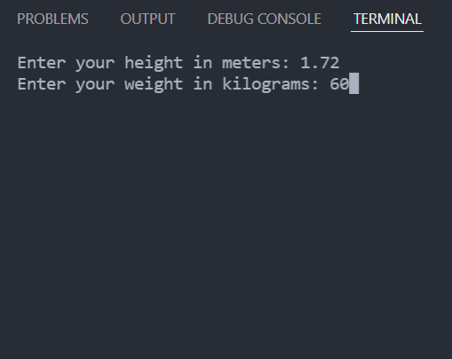
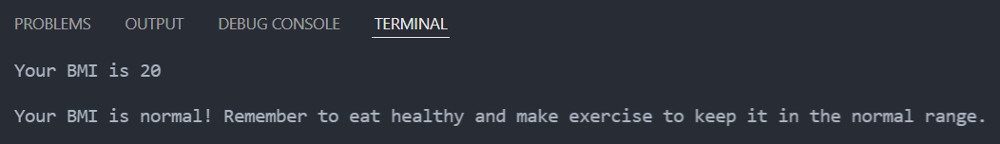

# BMI CALCULATOR

Use this simple program to calculate your Body Mass Index (BMI).

- Execute `python main.py` from the console
- Enter your height in meters (example: 1.72)
- Enter your weight in kilograms (example: 72)

The program will show your BMI and tell if it is healthy or not. As I am not a medic, I recommend you to not take this too seriously and
use it only as a reference to know aproximately if you are healthy. The source that allowed me to know the BMI's is the [cdc's website](https://www.cdc.gov/healthyweight/spanish/assessing/bmi/adult_bmi/metric_bmi_calculator/bmi_calculator.html)

